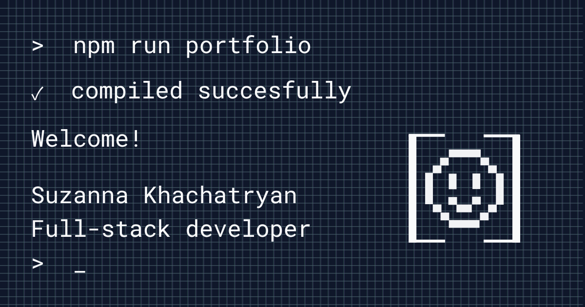

# Suzanna Khachatryan — Portfolio

Personal portfolio website for Suzanna Khachatryan, a full-stack developer based in Belgium. The site introduces her background and skills, showcases selected web and mobile projects, and provides an easy way to get in touch.



## Features

- Responsive single-page portfolio with hero, about, projects, and contact sections
- Dedicated, statically generated detail page for every project
- English and Dutch language support with a persistent language preference
- Light and dark themes with project-specific artwork
- Interactive project galleries powered by PhotoSwipe
- Accessible, reusable Astro UI components
- Project data managed from one typed TypeScript file

## Featured projects

The portfolio currently highlights MindMetric, EURConverted, Kompas, Exit.exe, Stuff, and IceDash. Together, they cover full-stack web development, progressive web apps, React Native applications, and mobile game development.

## Built with

- [Astro](https://astro.build/) and TypeScript
- [Tailwind CSS](https://tailwindcss.com/)
- [i18next](https://www.i18next.com/)
- [PhotoSwipe](https://photoswipe.com/)
- [Lucide](https://lucide.dev/) icons

## Getting started

Requires Node.js 22.12 or newer and pnpm.

```sh
pnpm install
pnpm astro dev --background
```

The development site is available at `http://localhost:4321`. Use `pnpm astro dev stop`, `pnpm astro dev status`, or `pnpm astro dev logs` to manage the background server.

## Commands

| Command | Description |
| --- | --- |
| `pnpm astro dev --background` | Start the development server in the background |
| `pnpm build` | Create a production build in `dist/` |
| `pnpm preview` | Preview the production build locally |
| `pnpm astro ...` | Run an Astro CLI command |

## Project structure

```text
public/
└── assets/              Project images, logos, and other static files
src/
├── components/          Page sections and reusable UI components
├── data/projects.ts     Typed project content and gallery metadata
├── i18n/                Translation setup and browser-side language logic
├── layouts/             Shared page layout and metadata
├── locales/             English and Dutch translations
├── pages/               Home page and dynamic project routes
└── styles/              Global, theme, and component styles
```

## Production build

```sh
pnpm build
pnpm preview
```

The site is statically generated by Astro and can be deployed to any static hosting provider.
